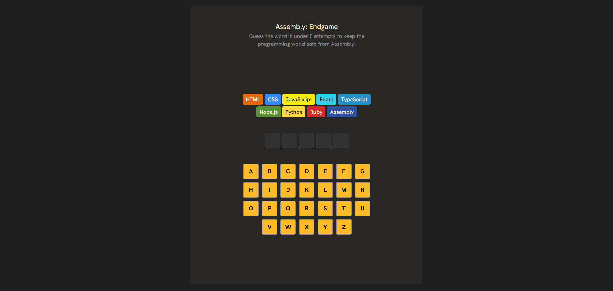

# Assembly: Endgame

A word guessing game inspired by Hangman, built with React and Tailwind CSS as part of Scrimba's Front End Developer Path. Guess the hidden word before you run out of attempts and save the programming world from Assembly.

## Preview



## Features

- Random word selection
- Interactive on-screen keyboard
- Correct and incorrect letter tracking
- Eliminated programming languages after wrong guesses
- Win and lose game states
- New game functionality
- Responsive design

## Built With

- React
- Tailwind CSS
- JavaScript (ES6+)
- Vite

## Installation

Clone the repository:

```bash
git clone https://github.com/your-username/assembly-endgame.git
```

Navigate to the project directory:

```bash
cd assembly-endgame
```

Install dependencies:

```bash
npm install
```

Start the development server:

```bash
npm run dev
```

## Project Structure

```text
src/
├── assets/
│──── components/
│         ├── Elimination.jsx
│         ├── Keyboard.jsx
│         ├── Match.jsx
│         ├── Status.jsx
│         └── Header.jsx
├──── utils/
│        ├── helper.js
│        └── words.js
├── App.jsx
└── main.jsx
```

## How to Play

1. A random word is selected.
2. Click letters on the keyboard to make guesses.
3. Correct guesses reveal matching letters.
4. Incorrect guesses eliminate one programming language.
5. Guess the entire word before all languages are eliminated.

## What I Learned

- Managing application state with React Hooks
- Conditional rendering
- Dynamic styling with Tailwind CSS
- Building reusable React components
- Implementing game logic
- Rendering lists efficiently
- Handling derived state

## Future Improvements

- Keyboard input support
- Animations and transitions
- Difficulty levels
- Score tracking
- Sound effects
- Accessibility improvements

## License

This project is open source and available under the MIT License.
